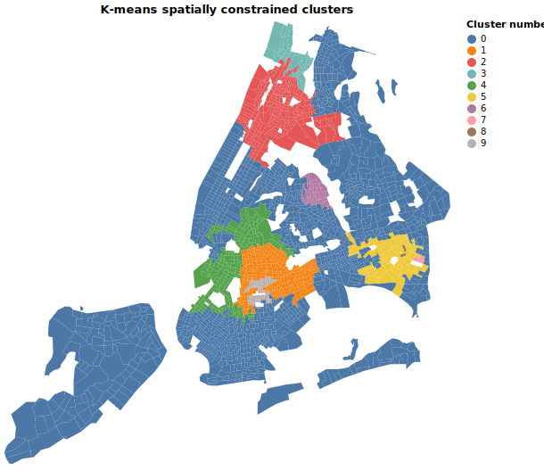

# Recalculating Gentrification Index

Tyring to recalculate the gentrification index developed by Glen D. Johnson, Melissa Checker, Scott Larson & Hanish Kodali.

For reference, please see the paper [A small area index of gentrification, applied to New York City](https://www.tandfonline.com/doi/full/10.1080/13658816.2021.1931873).

This recalculation is done with census data for 2019 and uses Python instead of R to process and analyze the data.

## Data analysis

The variables used are:

* 'mdfami00_19': Median household income (change between 2000 and 2019)
* 'A20_34y00_19': Percentage of the population aged between 20-34 (change in that percentage between 2000 and 2019)
* 'NHW00_19': Percentage of the population that is non-white (change in that percentage between 2000 and 2019)
* 'College00_19': Percentage of the population (older than 18) with a college degree or more (change in that percentage between 2000 and 2019)
* 'mdrent00_19': Median rent (change between 2000 and 2019)

For 2019 these variables come from the American Community Survey 5-year estimates.

### Relationship between variables

### Histogram for each variable

Do these histograms show the need to convert the variables to a logarithmic scale? The original analysis does it, but the explanatory power of the principal component analysis decreases with the log values.

### PCA variables plot

### Spatial lag

### Kernel smoothing

### Clustering (k-means)

#### Non spatial clusters

#### Spatially constrained clusters

I used the log version of the variables to run this algorithm.

