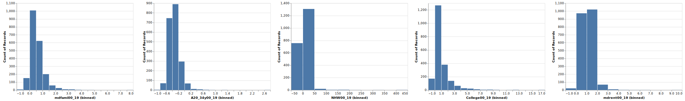
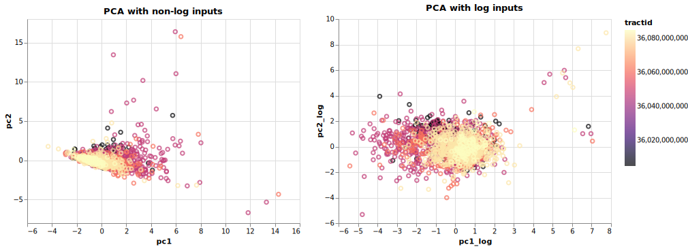

# Recalculating Gentrification Index

Tyring to recalculate the gentrification index developed by Glen D. Johnson, Melissa Checker, Scott Larson & Hanish Kodali.

For reference, please see the paper [A small area index of gentrification, applied to New York City](https://www.tandfonline.com/doi/full/10.1080/13658816.2021.1931873).

This recalculation is done with census data for 2019 and uses Python instead of R to process and analyze the data.

## Graphs

### Plotting the relationship between variables

### Histogram for each variable

### PCA variables plot

### Spatial lag

### Kernel smoothing

